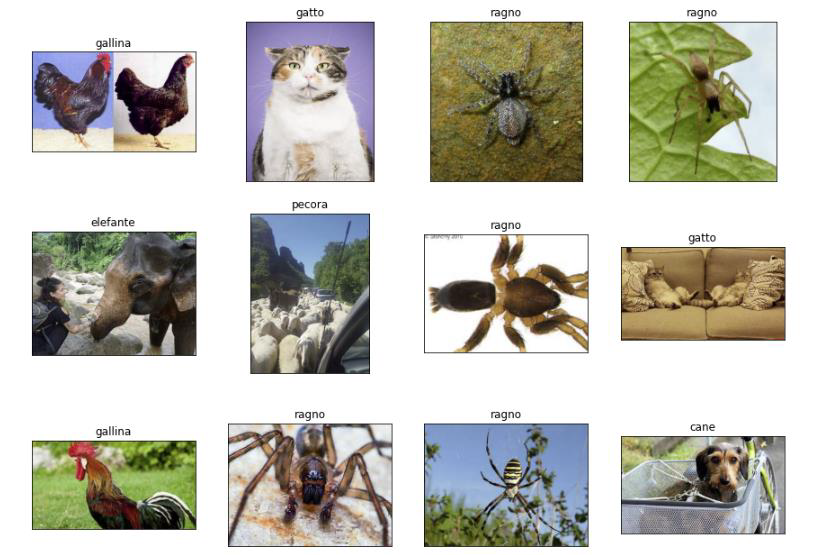
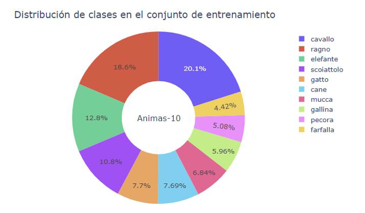
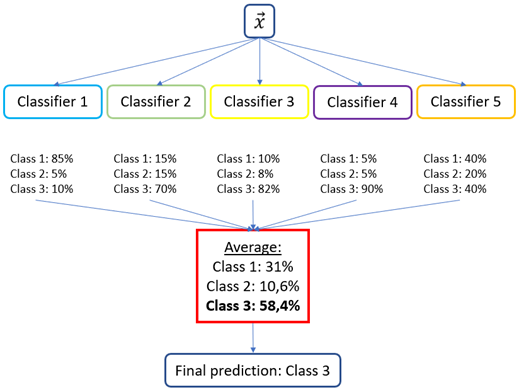
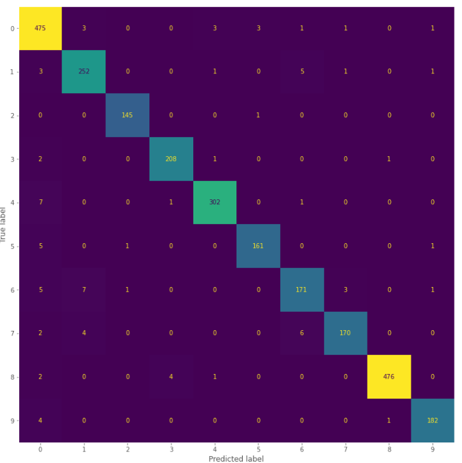

## Introducción

Proyecto de visión por computador que tiene como objetivo el desarrollo de un modelo que permita clasificar imágenes en función del animal que se encuentre en las mismas.

Para ello, se toma como fuente de datos el dataset del [enlace](https://www.kaggle.com/datasets/alessiocorrado99/animals10), que contiene instancias de 10 especies distintas en diferentes proporciones, por ende estando desbalanceado. Un ejemplo de una imagen por clase se muestra en la imagen inferior

 &nbsp;

&nbsp;

En cuanto a la proporción de las mismas, se tiene que es la sigueinte

 &nbsp;

&nbsp;

## Herramientas utilizadas
Para la realización de este proyecto se utilizarán las librerías principales para la ciencia de datos, el tratamiento de imágenes y redes neuronales, `numpy`, `pandas`, `cv2` y `keras`.

&nbsp;

## Balanceo de las clases

Para generar el mismo número de instancias en cada una de las clases y evitar que la mayoritaria gane importancia en metricas de evaluación como el accuracy, se generan instancias de las clases minoritarias aplicando técnicas de `data augmentation`, como el zooming y shifting en las instancias deseadas.

&nbsp;

## Modelos implementados

En primera instancia se prueba la creación de redes neuronales de filtros grandes y pequeños para evaluar su rendimiento. En segunda instancia, se usa entrenan modelos mediante **transfer learmning**, tomando CNN como `ResNet50`.

&nbsp;

Por último, para mejorar los resultados individuales de cada uno de los modelos y eliminar parte del error global cometido de forma individual (generalmente en este caso producido por la varianza de los modelos), se crea un **ensemble** de los anteriores, infiriendo la clase de una instancia por la clase mayoritaria de la media de las salidas de cada modelo.

 &nbsp;

### Evaluación de los resultados

Dado que las clases en este punto están balanceadas, se hace uso como metrica de error **accuracy**. La matriz de confusión del conjunto de test para el ensemble resultante es la siguiente:

 &nbsp;

